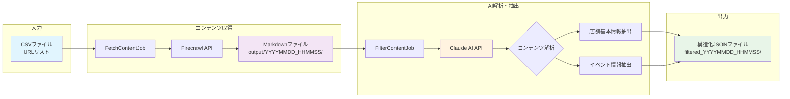

# Smart Crawl - Webコンテンツ取得・解析システム

Firecrawl APIを使用してWebページのコンテンツをMarkdown形式で取得し、Claude AIでイベント情報や店舗基本情報を構造化データとして抽出するPythonバッチ処理システムです。Docker環境で動作し、将来的にAPIサーバーの追加も可能な構成になっています。

## 🚀 特徴

- **Webコンテンツ取得**: Firecrawl APIを使用したWebページのスクレイピング
- **AI解析**: Claude AIによるイベント情報・店舗基本情報の自動抽出
- **Markdown形式**: 取得したコンテンツをMarkdown形式で保存
- **構造化データ**: 抽出した情報をJSON形式で構造化
- **バッチ処理**: URLリストから一括でコンテンツを取得・解析
- **Docker対応**: 本番環境と同じ環境で開発可能
- **構造化ログ**: structlogによる詳細なログ出力
- **設定管理**: 環境変数ベースの柔軟な設定
- **リトライ機構**: 失敗時の自動リトライ
- **拡張性**: 簡単に新しいバッチジョブを追加可能

## 📊 システムワークフロー



## 📁 プロジェクト構成

```
smart_crawl/
├── docker-compose.yml     # Docker構成
├── Makefile              # タスク実行用コマンド
├── .env.example          # 環境変数のサンプル
├── requirements/         # 依存パッケージ
│   ├── base.txt         # 基本パッケージ
│   ├── dev.txt          # 開発用パッケージ
│   └── prod.txt         # 本番用パッケージ
├── docker/              # Dockerfile
│   ├── batch/           # バッチ処理用
│   └── api/             # API用（将来）
├── src/                 # ソースコード
│   ├── batch/           # バッチ処理
│   │   ├── base.py      # 基底クラス
│   │   ├── main.py      # エントリポイント
│   │   └── jobs/        # ジョブ実装
│   │       ├── fetch_content_job.py   # コンテンツ取得ジョブ
│   │       └── filter_content_job.py  # AI解析・抽出ジョブ
│   ├── common/          # 共通モジュール
│   │   ├── config.py    # 設定管理
│   │   ├── logging.py   # ログ設定
│   │   ├── llm_service.py # Claude AI連携サービス
│   │   └── exceptions.py # カスタム例外
│   └── api/             # API（将来）
├── tests/               # テストコード
├── input/               # 入力ファイル（CSVなど）
├── output/              # 出力ファイル（取得したコンテンツ）
└── data/               # データディレクトリ
```

## 🔧 セットアップ

### 前提条件

- Python 3.11以上
- Docker & Docker Compose
- Make

### 初回セットアップ

1. リポジトリをクローン:
```bash
git clone <repository-url>
cd smart_crawl
```

2. 環境変数ファイルを作成:
```bash
cp .env.example .env
# .envファイルを編集して以下のAPIキーを設定
# FIRECRAWL_API_KEY=your_firecrawl_api_key_here
# ANTHROPIC_API_KEY=your_claude_api_key_here
```

3. セットアップ実行:
```bash
# Python仮想環境の作成と依存パッケージのインストール
make setup

# Dockerイメージのビルド
make build

# コンテナ起動
make up
```

## 📝 使い方

### Makeコマンド一覧

```bash
make help         # ヘルプ表示
make setup        # 初回セットアップ
make build        # Dockerイメージビルド
make up           # コンテナ起動
make down         # コンテナ停止
make restart      # コンテナ再起動
make run-batch    # バッチジョブ実行
make test         # テスト実行
make lint         # コード品質チェック
make clean        # キャッシュクリーンアップ
make logs         # ログ表示
make shell        # コンテナ内シェル接続
make status       # コンテナステータス確認
```

### コンテンツ取得・解析の実行

#### 1. URLリストの準備

`input/urls.csv`ファイルを作成し、取得したいURLを記載:
```csv
url
https://example.com
https://example2.com
```

#### 2. コンテンツ取得ジョブの実行

```bash
# Dockerでコンテンツ取得ジョブを実行
docker-compose run --rm batch python -m src.batch.main fetch_content

# または Makefile を使用
make run-batch JOB_NAME=fetch_content
```

取得したコンテンツは`output/YYYYMMDD_HHMMSS/`ディレクトリに保存されます:
- ファイル名: `{連番}_{タイムスタンプ}.md`
- 例: `output/20250319_143022/001_20250319_143022.md`

#### 3. AI解析・抽出ジョブの実行

```bash
# 店舗基本情報とイベント情報を抽出
docker-compose run --rm batch python -m src.batch.main filter_content

# または Makefile を使用
make run-batch JOB_NAME=filter_content
```

#### 4. 結果の確認

抽出された構造化データは`output/filtered_YYYYMMDD_HHMMSS/`ディレクトリに保存されます:
- ファイル名: `filtered_{元ファイル名}_{タイムスタンプ}.json`
- 例: `output/filtered_20250319_143500/filtered_001_20250319_143022_20250319_143500.json`

**JSONデータ構造:**
```json
{
  "has_event": true/false,
  "store_info": {
    "name": "店舗名",
    "category": "業種",
    "description": "店舗説明",
    "address": "住所",
    "business_hours": "営業時間",
    "features": ["特徴1", "特徴2"]
  },
  "events": [
    {
      "title": "イベント名",
      "category": "カテゴリ",
      "start_date": "2025-01-01",
      "description": "イベント説明"
    }
  ]
}
```

### 新しいバッチジョブの追加

1. `src/batch/jobs/`に新しいジョブファイルを作成:

```python
# src/batch/jobs/my_job.py
from src.batch.base import BaseBatchJob

class MyJob(BaseBatchJob):
    def __init__(self):
        super().__init__("MyJob")
    
    def execute(self):
        self.logger.info("Executing my job...")
        # ジョブのロジックをここに実装
        return {"status": "completed"}
```

2. `src/batch/main.py`のジョブレジストリに追加:

```python
from src.batch.jobs.my_job import MyJob

AVAILABLE_JOBS = {
    "fetch_content": FetchContentJob,
    "filter_content": FilterContentJob,
    "my_job": MyJob,  # 追加
}
```

3. 実行:
```bash
make run-batch JOB_NAME=my_job
```

## 🧪 テスト

### テストの実行

```bash
# Dockerコンテナ内でテスト実行
make test

# ローカル環境でテスト（要venv）
source venv/bin/activate
pytest tests/ -v
```

### 特定のテストファイルを実行

```bash
docker-compose run --rm batch pytest tests/test_fetch_content.py -v
```

### カバレッジレポート付きテスト

```bash
docker-compose run --rm batch pytest tests/ --cov=src --cov-report=html
```

## 🔍 開発

### ローカル開発環境

```bash
# 仮想環境を有効化
source venv/bin/activate

# 開発用パッケージインストール済みの環境で開発
python -m src.batch.main fetch_content

# コード品質チェック（ローカル）
make lint-local
```

### コンテナ内でデバッグ

```bash
# コンテナ内シェルに接続
make shell

# コンテナ内でPythonインタプリタ起動
python

# またはipythonを使用
ipython
```

## 📊 ログ

### ログの確認

```bash
# リアルタイムログ表示
make logs

# 特定のサービスのログ
docker-compose logs -f batch
```

### ログ設定

`.env`ファイルでログレベルを設定:
```
LOG_LEVEL=DEBUG  # DEBUG, INFO, WARNING, ERROR
```

開発環境では色付きの構造化ログ、本番環境ではJSON形式のログが出力されます。

## 🔐 環境変数

主要な環境変数（`.env`ファイル）:

```bash
# 環境設定
ENV=development           # development, production
DEBUG=True               # デバッグモード

# ログ設定
LOG_LEVEL=INFO           # ログレベル

# バッチ処理設定
BATCH_MAX_WORKERS=4      # 最大ワーカー数
BATCH_RETRY_COUNT=3      # リトライ回数
BATCH_TIMEOUT_SECONDS=300 # タイムアウト（秒）

# API設定
FIRECRAWL_API_KEY=your_firecrawl_api_key_here  # Firecrawl APIキー（必須）
ANTHROPIC_API_KEY=your_claude_api_key_here     # Claude APIキー（必須）
```

## 🚀 将来の拡張

### APIサーバーの追加

1. `docker/api/Dockerfile`を作成
2. `docker-compose.yml`のAPIセクションをアンコメント
3. `src/api/`にAPIコードを実装

### データベースの追加

1. `docker-compose.yml`のpostgresセクションをアンコメント
2. `.env`にデータベース接続情報を追加
3. SQLAlchemyやDjangoORMを導入

### Redisの追加

1. `docker-compose.yml`のredisセクションをアンコメント
2. `.env`にRedis接続情報を追加
3. ジョブキューやキャッシュとして活用

## 📚 依存関係

### コアライブラリ

- **requests**: HTTP通信（Firecrawl API連携）
- **anthropic**: Claude AI API連携
- **pydantic**: 設定管理とバリデーション
- **structlog**: 構造化ログ
- **tenacity**: リトライロジック
- **python-dotenv**: 環境変数管理

### 開発ツール

- **pytest**: テストフレームワーク
- **black**: コードフォーマッター
- **flake8**: リンター
- **mypy**: 型チェッカー

## 🤝 コントリビューション

1. Featureブランチを作成
2. 変更をコミット
3. テストを実行して全てパスすることを確認
4. プルリクエストを作成

## 📄 ライセンス

[MITライセンス](LICENSE)