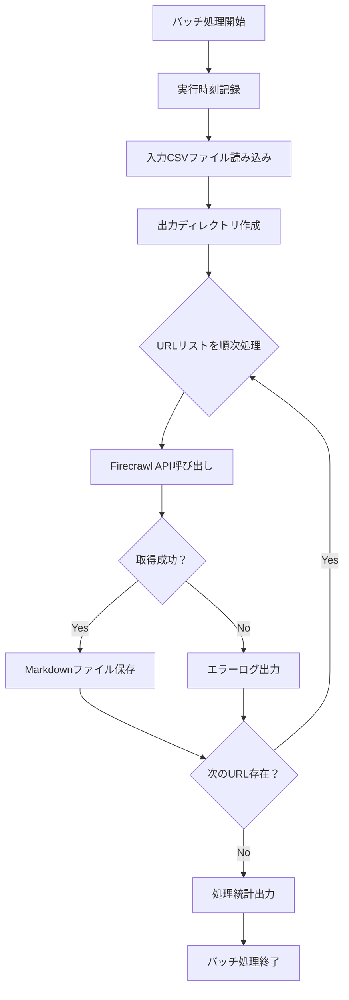

# URLコンテンツ取得

---

## 概要 (Overview)

### 目的 (Purpose)
指定したURLのリストからコンテンツを取得する

### 背景 (Background)
特定のHPからそこに表示されているイベントの情報を取得したい。
その第一歩として、URLから表示されているコンテンツを取得する部分を実装する。
HPは基本的に現実に存在している店舗などのHPである。

---

## 仕様 (Specifications)

### 基本仕様
- コンテンツの取得にはFirecrawl APIのscrapeエンドポイントを使用する
- 取得形式はMarkdown形式とする
- 単一ページのみを取得（リンク先は含まない）
- 入力はCSVファイルに記載する（URL列、ヘッダー行あり）
- 入力ファイルはinputディレクトリに保存する
- 出力は個別のMarkdownファイル（1URL = 1ファイル）
- 結果はoutputディレクトリ内の実行時刻サブディレクトリに保存される
- Firecrawl APIキーは.envファイルから取得する（FIRECRAWL_API_KEY）
- バッチ処理として実装し、手動実行する
- これは一連のバッチ処理の最初のステップとして実装される

---

## 詳細設計

### 処理フロー



### ディレクトリ構造

```
smart_crawl/
├── input/                         # 入力ファイル格納ディレクトリ
│   └── urls.csv                  # URL一覧CSVファイル
├── output/                        # 出力ファイル格納ディレクトリ
│   └── YYYYMMDD_HHMMSS/         # 実行時刻別サブディレクトリ
│       ├── 001_YYYYMMDD_HHMMSS.md
│       ├── 002_YYYYMMDD_HHMMSS.md
│       └── ...
├── src/
│   └── batch/
│       ├── jobs/
│       │   └── fetch_content_job.py  # 新規作成
│       └── main.py                   # 修正（ジョブ登録）
└── .env                              # 修正（APIキー追加）
```

### 修正・新規作成対象

#### 1. 新規作成
- **src/batch/jobs/fetch_content_job.py**
  - FetchContentJobクラスの実装
  - BaseBatchJobを継承

#### 2. 修正
- **.env.example**
  - FIRECRAWL_API_KEYの追加
- **.env**
  - FIRECRAWL_API_KEYの設定
- **src/batch/main.py**
  - AVAILABLE_JOBSへのfetch_contentジョブ登録
  - sample_jobのimportと登録を削除

#### 3. 削除
- **src/batch/jobs/sample_job.py**
- **tests/test_sample_job.py**

### 入出力仕様

#### 入力CSVファイル形式
```csv
url
https://example1.com
https://example2.com
https://example3.com
```
- ヘッダー行必須（url）
- URL列のみを含む
- ファイル名：任意（例：urls.csv）
- 文字コード：UTF-8

#### 出力ファイル形式
- ファイル名：`{連番}_{実行時刻}.md`
  - 連番：001, 002, 003...（3桁ゼロパディング）
  - 実行時刻：YYYYMMDD_HHMMSS形式
  - 例：`001_20240315_143022.md`
- 内容：Firecrawl APIから取得したMarkdown形式のコンテンツ
- 保存先：`output/YYYYMMDD_HHMMSS/`ディレクトリ

### 処理詳細

#### FetchContentJobクラスの処理内容

1. **初期化処理（__init__）**
   - ジョブ名を"FetchContent"として設定
   - 必要な設定値の初期化

2. **前処理（before_execute）**
   - input/outputディレクトリの存在確認
   - inputディレクトリ内のCSVファイル存在確認
   - Firecrawl APIキーの存在確認
   - 実行時刻の記録とタイムスタンプ生成
   - 出力ディレクトリの作成

3. **メイン処理（execute）**
   - CSVファイルの読み込み処理
     - pandasまたはcsvモジュールを使用
     - ヘッダー行の検証（url列の存在確認）
   - URL毎の処理ループ
     - 連番カウンターの管理
     - Firecrawl API呼び出し
       - エンドポイント：POST /scrape
       - リクエストボディ：{"url": "対象URL", "format": "markdown"}
       - ヘッダー：{"Authorization": "Bearer {API_KEY}"}
     - レスポンス処理
       - 成功時：Markdownコンテンツの取得と保存
       - 失敗時：エラーログ出力とスキップ
   - 処理統計の集計
     - 総URL数
     - 成功数
     - 失敗数
     - 成功率

4. **後処理（after_execute）**
   - 処理結果サマリーのログ出力
   - 出力ディレクトリパスの表示

5. **エラー処理（on_error）**
   - 致命的エラーの通知
   - 部分的に作成されたファイルの情報保持

### エラーハンドリング

| エラー種別 | 処理方法 |
|-----------|----------|
| CSVファイル不在 | 処理中断、エラーメッセージ出力 |
| APIキー未設定 | 処理中断、設定手順の案内出力 |
| 個別URL取得失敗 | スキップして次のURLへ、エラーログ記録 |
| API接続失敗 | リトライ（BaseBatchJobの機能を利用） |
| ディレクトリ作成失敗 | 処理中断、権限エラーの可能性を通知 |

---

## 実装手順と動作確認

### Step 1: 環境設定とディレクトリ準備
**実装内容**：
- .envファイルにFIRECRAWL_API_KEY設定を追加
- input/outputディレクトリの作成
- サンプルCSVファイルの作成

**動作確認**：
```bash
# ディレクトリ確認
ls -la input/ output/

# 環境変数確認
python -c "import os; print(os.getenv('FIRECRAWL_API_KEY'))"
```

### Step 2: 基本クラス実装とCSV読み込み
**実装内容**：
- FetchContentJobクラスの基本構造作成
- CSVファイル読み込み機能の実装
- URL一覧の取得とログ出力

**動作確認**：
```bash
# バッチ実行（URL一覧の表示確認）
python -m src.batch.main fetch_content

# ログ確認でURL数と内容を検証
```

### Step 3: Firecrawl API連携
**実装内容**：
- Firecrawl APIクライアント機能の実装
- 単一URLに対するscrape呼び出し
- レスポンスのMarkdown取得

**動作確認**：
```bash
# 1つのURLでテスト実行
echo "url\nhttps://example.com" > input/test.csv
python -m src.batch.main fetch_content

# API呼び出しログとレスポンス確認
```

### Step 4: ファイル保存機能
**実装内容**：
- タイムスタンプ付きディレクトリ作成
- 連番付きファイル名生成
- Markdownコンテンツの保存

**動作確認**：
```bash
# 複数URLでの実行
python -m src.batch.main fetch_content

# 出力ファイル確認
ls -la output/*/
cat output/*/001_*.md | head -20
```

### Step 5: エラーハンドリングと統計出力
**実装内容**：
- 個別URL失敗時の処理継続
- 処理統計の集計と出力
- 包括的なログ出力

**動作確認**：
```bash
# 存在しないURLを含むCSVでテスト
echo "url\nhttps://example.com\nhttps://invalid-url-12345.com" > input/mixed.csv
python -m src.batch.main fetch_content

# ログで成功/失敗の統計確認
# 成功したURLのファイルのみ存在することを確認
```

### Step 6: 既存ファイルのクリーンアップ
**実装内容**：
- sample_job.pyの削除
- test_sample_job.pyの削除
- main.pyからsample_job関連の削除

**動作確認**：
```bash
# ジョブ一覧確認（sampleが消えていることを確認）
python -m src.batch.main

# fetch_contentが表示されることを確認
```

---

## 最終要件

### 機能要件
1. **CSV入力処理**
   - inputディレクトリ内のCSVファイルからURL一覧を読み込む
   - ヘッダー行（url）の存在を検証する
   - 空行や不正なURLはスキップする

2. **Firecrawl API連携**
   - 各URLに対してscrapeエンドポイントを呼び出す
   - Markdown形式でコンテンツを取得する
   - APIキーは環境変数から取得する

3. **ファイル出力**
   - バッチ実行時刻のタイムスタンプディレクトリを作成する
   - URL毎に連番付きのMarkdownファイルを生成する
   - ファイル名は「連番_タイムスタンプ.md」形式とする

4. **エラー処理**
   - 個別URLの取得失敗時は処理を継続する
   - 失敗したURLはログに記録する
   - 成功したURLのコンテンツのみ保存する

5. **処理結果出力**
   - 処理完了後に統計情報を出力する
   - 総URL数、成功数、失敗数、成功率を表示する
   - 出力ディレクトリパスを表示する

### 検証項目
- [ ] CSVファイルからURL一覧が正しく読み込まれる
- [ ] Firecrawl APIへの接続が成功する
- [ ] Markdownコンテンツが正しく取得される
- [ ] ファイルが指定形式で保存される
- [ ] エラー発生時も処理が継続される
- [ ] 処理統計が正確に出力される
- [ ] 既存のsample_jobが削除されている

---