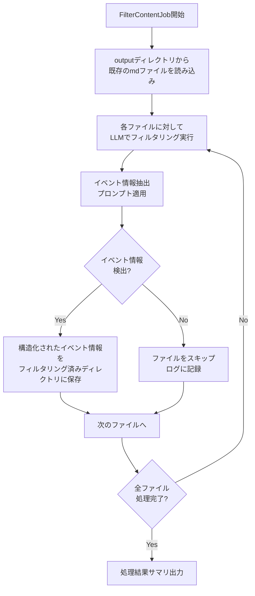

# 取得してきたコンテンツのフィルタリング

---

## 概要 (Overview)

### 目的 (Purpose)
URLから取得してきたコンテンツの内容をLLMを使ってフィルタリングし、必要な情報だけを残す。
必要な情報とはイベントの情報である。

### 背景 (Background)
特定のHPからそこに表示されているイベントの情報を取得したい。
HPは基本的に現実に存在している店舗などのHPである。

現在URLからその内容を取得してくる機能が実装済みである。
今回実装する機能はその出力を適切にフィルタリングする機能である。

---

## 仕様 (Specifications)
- フィルタリングにはLLMを用いる
- 残すイベント情報の定義を明確にプロンプトで定義する
  - イベントの日時
  - 場所
  - イベントの内容
  - イベントの対象(子連れの家族など)
  - 参加費用などのコスト
  - その他イベントの情報
- LLMはAnthoropicのClaude 4 Sonnetを用いる
- ClaudeのAPIキーはenvファイルから取得する
- 結果はoutputディレクトリにmdファイルで保存する
- LLMを使用する部分は共通処理として実装する

---

## 具体的な実装詳細 (Concrete Implementation Details)

### 修正・新規作成対象
以下のファイルを新規作成または修正します：

1. **新規作成**
   - `src/batch/jobs/filter_content_job.py` - コンテンツフィルタリングジョブ
   - `src/common/llm_service.py` - Claude API呼び出し用共通サービス

2. **修正**
   - `src/batch/main.py` - 新ジョブの登録
   - `src/common/config.py` - Claude APIキー設定の追加

### 処理フロー



### 処理内容詳細

#### FilterContentJobの処理内容
1. **入力処理**
   - outputディレクトリから最新のタイムスタンプディレクトリを自動検出
   - ディレクトリ内の全mdファイルを読み込み対象として収集

2. **LLMフィルタリング処理**
   - 各markdownファイルの内容をClaude APIに送信
   - 以下のプロンプトテンプレートを使用：
     ```
     以下のウェブページコンテンツからイベント情報のみを抽出してください。
     イベント情報が含まれていない場合は「イベント情報なし」と回答してください。

     抽出すべき情報：
     - イベントの日時（開始・終了）
     - 開催場所（住所・会場名）
     - イベントの内容・概要
     - 対象者（子連れファミリー、年齢制限など）
     - 参加費用・料金
     - 予約・申込方法
     - その他関連情報

     出力は以下のJSON形式で返してください：
     ```

3. **出力フォーマット**
   ```json
   {
     "has_event": true/false,
     "events": [
       {
         "title": "イベント名",
         "datetime": {
           "start": "2024-03-20T10:00:00",
           "end": "2024-03-20T16:00:00"
         },
         "location": {
           "venue": "会場名",
           "address": "住所"
         },
         "description": "イベント内容の説明",
         "target_audience": "対象者",
         "cost": "参加費用",
         "booking_info": "予約方法",
         "additional_info": "その他情報"
       }
     ],
     "source_url": "元のURL",
     "processed_at": "2024-03-20T12:00:00"
   }
   ```

4. **ファイル保存**
   - フィルタリング結果を `output/{timestamp}_filtered/` ディレクトリに保存
   - ファイル名: `{sequence}_filtered_{timestamp}.md`
   - イベント情報が検出されなかった場合はファイル作成をスキップ

#### LLMServiceの共通処理
1. **APIクライアント管理**
   - Claude APIキーの環境変数からの取得
   - HTTPクライアントの初期化と設定
   - リトライ機能（3回まで、指数バックオフ）

2. **プロンプト管理**
   - テンプレート化されたプロンプトの管理
   - コンテンツの長さに応じた分割処理

3. **レスポンス処理**
   - JSON形式での回答パース
   - エラーハンドリングとログ出力

### 実装手順と動作確認方法

#### Step 1: LLMサービス共通クラスの実装
**実装内容:**
- `src/common/llm_service.py`の作成
- Claude API呼び出し機能
- プロンプトテンプレート管理

**動作確認:**
```bash
# 単体テストの実行
docker-compose run --rm batch python -c "
from src.common.llm_service import LLMService
service = LLMService()
result = service.extract_event_info('テスト用のmarkdownコンテンツ')
print(result)
"
```

#### Step 2: FilterContentJobクラスの実装
**実装内容:**
- `src/batch/jobs/filter_content_job.py`の作成
- BaseBatchJobを継承したジョブクラス
- ファイル読み込み・処理・保存ロジック

**動作確認:**
```bash
# 既存のfetch_contentで生成されたファイルを使用
docker-compose run --rm batch python -m src.batch.main fetch_content
docker-compose run --rm batch python -c "
from src.batch.jobs.filter_content_job import FilterContentJob
job = FilterContentJob()
job.before_execute()
print(f'処理対象ファイル数: {len(job.input_files)}')
"
```

#### Step 3: ジョブ登録とエントリポイント修正
**実装内容:**
- `src/batch/main.py`でfilter_contentジョブを登録
- 環境変数設定の確認

**動作確認:**
```bash
# 利用可能ジョブの確認
docker-compose run --rm batch python -m src.batch.main
# filter_contentが表示されることを確認
```

#### Step 4: 統合テストの実行
**実装内容:**
- 全体のワークフローテスト
- エラーハンドリングの確認

**動作確認:**
```bash
# 完全なワークフローテスト
docker-compose run --rm batch python -m src.batch.main filter_content
# 処理結果の確認
ls output/*/
ls output/*_filtered/
```

#### Step 5: パフォーマンステストと調整
**実装内容:**
- 大量ファイル処理時の性能確認
- メモリ使用量の最適化

**動作確認:**
```bash
# 処理時間とリソース使用量の監視
docker-compose run --rm batch python -m src.batch.main filter_content
# ログからレスポンス時間を確認
```

### 最終的に満たすべき要件

#### 機能要件
1. **入力処理**
   - FetchContentJobで生成されたmarkdownファイルを自動検出・読み込み
   - ファイル形式バリデーション（markdownファイルのみ対象）

2. **フィルタリング処理**
   - Claude 4 Sonnet APIを使用したイベント情報抽出
   - 構造化されたJSON形式での情報整理
   - イベント情報が存在しない場合の適切なスキップ処理

3. **出力処理**
   - フィルタリング済みディレクトリへの結果保存
   - 元ファイルとの関連性維持（ファイル名規則）
   - 処理サマリの出力（成功/失敗/スキップ件数）

#### 非機能要件
1. **エラーハンドリング**
   - API呼び出し失敗時のリトライ機能
   - 個別ファイル処理失敗時のバッチ継続
   - 詳細なエラーログ出力

2. **パフォーマンス**
   - APIレート制限への対応
   - メモリ効率的なファイル処理
   - 処理進捗の可視化

3. **設定管理**
   - 環境変数からのAPIキー取得
   - プロンプトテンプレートの外部設定化
   - ログレベルの調整可能性

#### 成功判定基準
1. 既存のFetchContentJobで生成されたファイルを100%読み込み可能
2. Claude APIからの回答を90%以上正常にパース可能
3. イベント情報を含むコンテンツを95%以上正確に検出
4. 処理時間が1ファイルあたり平均10秒以内
5. メモリ使用量が利用可能メモリの50%以内

---